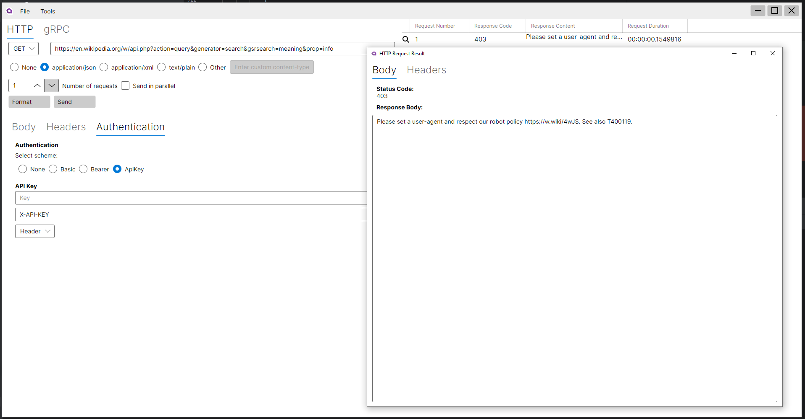

# ApiTester

ApiTester is a small Avalonia desktop application for crafting and sending HTTP requests. It provides a straightforward way to build requests, add headers and authentication, send requests, view responses, and persist request configurations.



## What it does

- Build HTTP requests (method, URL, body).
- Add, remove, and persist headers.
- Select and apply authentication (None, Basic, Bearer, API key).
- Send requests and view responses.
- Copy the current request as a curl command or PowerShell snippet.
- Save and load request configurations to/from JSON files.

## Where to look in the source

- Main UI: `Views/MainWindow.axaml`
- View model + behavior: `ViewModels/MainWindowViewModel.cs`
- Request builder (applies headers & auth): `Builders/MessageBuilder.cs`
- Models: `Models/HeaderEntry.cs`, `Models/SerializableHeader.cs`, `Models/HttpRequestPersistentDataModel.cs`
- Services: `Services/PersistenceService.cs`, `Services/FormatterService.cs`

## Build & run

Prerequisites:

- .NET SDK (project targets .NET 8.0)

Build in the repo root:

```bash
dotnet build
```

Run the app:

```bash
dotnet run
```

## Usage notes

- Headers: add rows and set name/value pairs; Content-Type is handled by the headers panel.
- Authentication: choose a scheme and provide credentials/tokens before sending.
- Copy actions: use the File/Tools menu or keyboard shortcuts to copy as curl or PowerShell.
- Authentication:
  - Choose a scheme, fill the fields and click `Send`.
  - Basic auth uses `Authorization: Basic <base64(user:pass)>`.
  - Bearer uses `Authorization: Bearer <token>`.
  - ApiKey by default adds a header named `X-API-KEY`; change the name in the `API Key` panel if you need a different header or query parameter name.

  ### Copying to PowerShell

  If you paste a curl command (the app's "Copy as curl" output) into PowerShell, note that PowerShell's `-Headers` parameter expects a hashtable / IDictionary rather than curl-style `-H` strings. If you prefer to run requests from PowerShell, you can convert the curl headers into a hashtable or use the `Invoke-RestMethod` approach shown below.

  Quick PowerShell example (equivalent to a curl with JSON + header):

  ```powershell
  $uri = 'https://example.com/api'
  $body = '{"name":"value"}'
  $headers = @{ 'Content-Type' = 'application/json'; 'X-API-KEY' = 'your_key' }
  Invoke-RestMethod -Uri $uri -Method POST -Headers $headers -Body $body
  ```

## Security

The app persists request configuration but avoids writing authentication secrets to saved JSON by default.

## Next steps / Improvements

If you'd like any of these implemented, tell me which one and I will add it.

Generated from the current workspace on October 19, 2025. Use this README as a quick reference while developing and testing the app.
Made with copilot

## License

This project is licensed under the MIT License — see the `LICENSE` file in the repository root for details.
